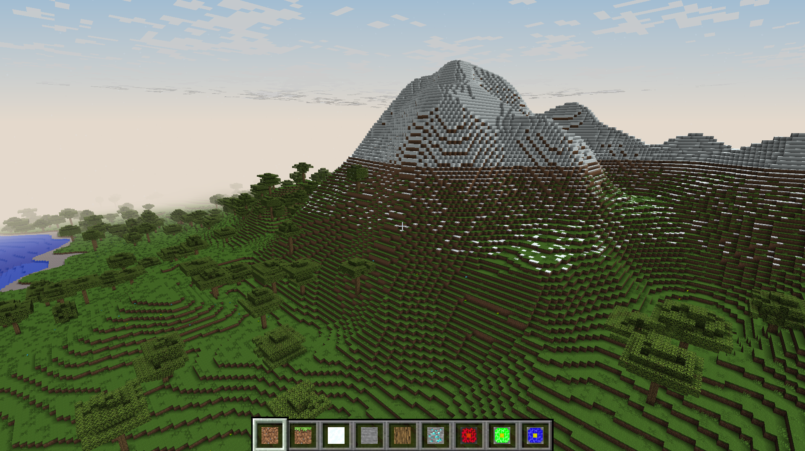
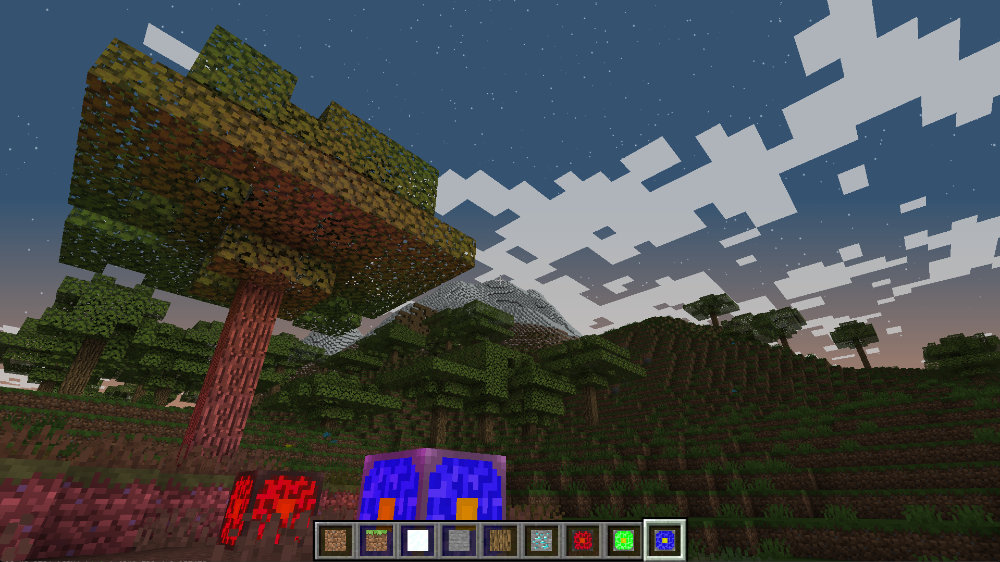

# minecraft-clone

## Intro
Hi everyone!
This is yet another Minecraft clone/voxel engine written in C++ and OpenGL.
I am doing this mainly for learning purposes,
since I am trying to get into graphics programming. I have no previous experience with game engines and this is my
first OpenGL project, so forgive my bad design decisions.
I will work on this in my spare time and update this repo as I progress.




## Features
- [x] Infinite terrain generation
- [x] Place/destroy blocks
- [x] Frustum culling
- [x] "Phyisics"
- [x] Trees (is this a feature?)
- [x] Day/night cycle
- [x] Ambient occlusion
- [x] Diffuse lighting
- [x] RGB lights
- [x] Very basic GUI
- [ ] Smooth lighting
- [ ] Cool water shader
- [ ] Multithreading
- [ ] Arena allocator
- [ ] Shadow mapping
- [ ] Greedy meshing

## How to build
```
git clone --recursive https://github.com/simsax/minecraft-clone.git
cd minecraft-clone
mkdir build
cd build
cmake -S .. -B . -DCMAKE_BUILD_TYPE=Release
make
```
If you are on Windows, just use Visual Studio and import as a cmake project.

## Commands
* `WASD` to move
* `SHIFT` to sprint
* `F` to activate/deactive gravity
* `P` to pause
* `SPACE` to jump/fly up
* `CTRL` to fly down
* `G` to deactivate/activate gui
* `1,2,3,...` or scroll wheel to select a block
* `left click` to destroy a block
* `right click` to place a block

## References
* https://www.youtube.com/watch?v=4O0_-1NaWnY&ab_channel=jdh (the inspiration)
* https://youtu.be/W3gAzLwfIP0
* https://learnopengl.com/
* http://www.lighthouse3d.com/tutorials/view-frustum-culling/
* https://github.com/UnknownShadow200/ClassiCube
* https://www.redblobgames.com/maps/terrain-from-noise/#noise
* https://www.reddit.com/r/gamedev/comments/2iru8i/fast_flood_fill_lighting_in_a_blocky_voxel_game/
* https://0fps.net/2013/07/03/ambient-occlusion-for-minecraft-like-worlds/
